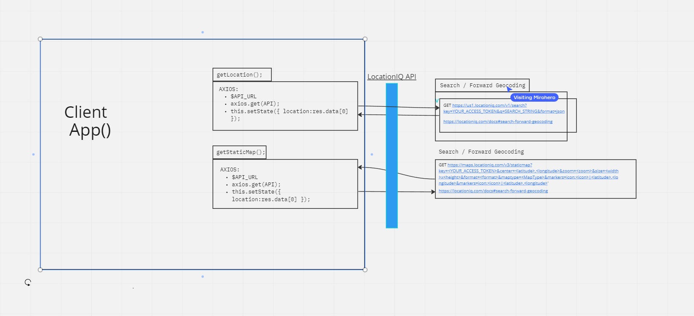

# City Explorer

**Author**: Joshua Coffey
**Version**: 1.0.0 (increment the patch/fix version number if you make more commits past your first submission)

## Overview
<!-- Provide a high level overview of what this application is and why you are building it, beyond the fact that it's an assignment for this class. (i.e. What's your problem domain?) -->
 
- Making a city map locator to view any city in the world.

## Getting Started
<!-- What are the steps that a user must take in order to build this app on their own machine and get it running? -->

- Create React app

- Have a plan

- Get API

## Architecture
<!-- Provide a detailed description of the application design. What technologies (languages, libraries, etc) you're using, and any other relevant design information. -->

- Bootstrap for the styling

- React for the interactivity

- API from LocationIQ

- Trello for project management

- Netlify for site deployment

## Change Log
<!-- Use this area to document the iterative changes made to your application as each feature is successfully implemented. Use time stamps. Here's an example:

01-01-2001 4:59pm - Application now has a fully-functional express server, with a GET route for the location resource. -->
- I did not read this before working on the assignment so I do not know the timestamps

## Credit and Collaborations
<!-- Give credit (and a link) to other people or resources that helped you build this application. -->

- WRRC Aaron Imbrock and I

